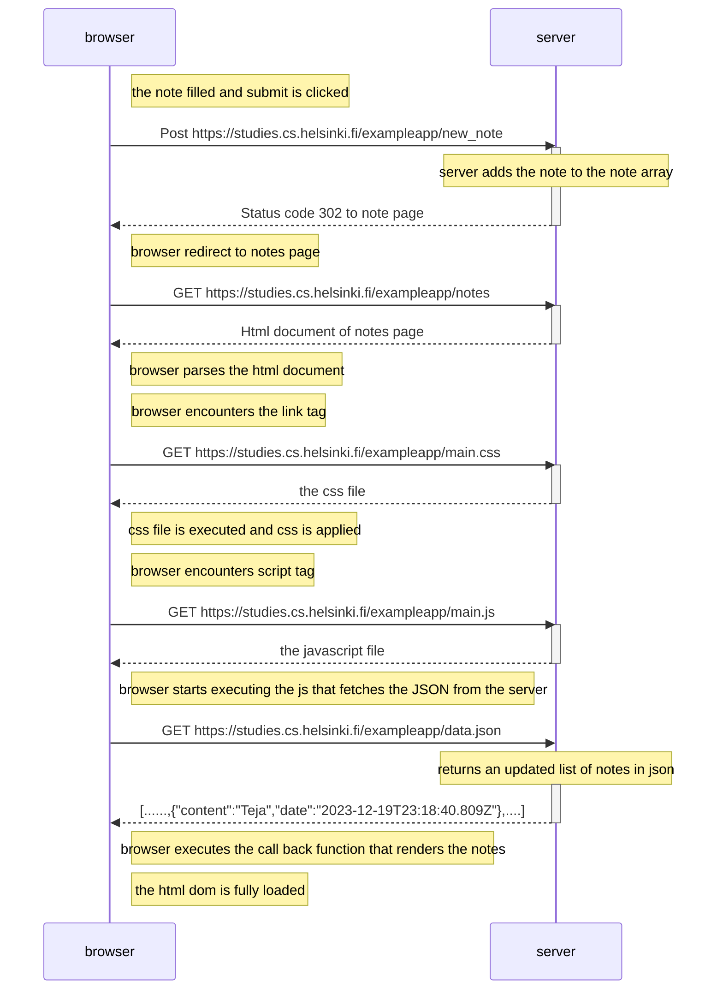

# Sequence diagram of communication between browser and server when a new note is added 

```mermaid 
sequenceDiagram
    participant browser
    participant server

    Note right of browser: the note filled and submit is clicked

    browser->>server: Post  https://studies.cs.helsinki.fi/exampleapp/new_note
    
    activate server
    Note over server: server adds the note to the note array
    server-->>browser: Status code 302 to note page
    deactivate server

    Note right of browser: browser redirect to notes page

    browser ->> server :GET  https://studies.cs.helsinki.fi/exampleapp/notes

    activate server
    server -->> browser: Html document of notes page
    deactivate server

    Note right of browser: browser parses the html document

    Note right of browser: browser encounters the link tag

    browser  ->> server: GET  https://studies.cs.helsinki.fi/exampleapp/main.css

    activate server
    server-->> browser: the css file
    deactivate server

    Note right of browser: css file is executed and css is applied

    Note right of browser: browser encounters script tag

    browser  ->> server: GET  https://studies.cs.helsinki.fi/exampleapp/main.js

    activate server
    server-->> browser: the javascript file
    deactivate server

    Note right of browser: browser starts executing the js that fetches the JSON from the server

    browser ->> server: GET https://studies.cs.helsinki.fi/exampleapp/data.json

    Note over server:returns an updated list of notes in json

    activate server
    server -->> browser: [......,{"content":"Teja","date":"2023-12-19T23:18:40.809Z"},....]
    deactivate server

    Note right of browser: browser executes the call back function that renders the notes
    
    Note right of browser : the html dom is fully loaded

```